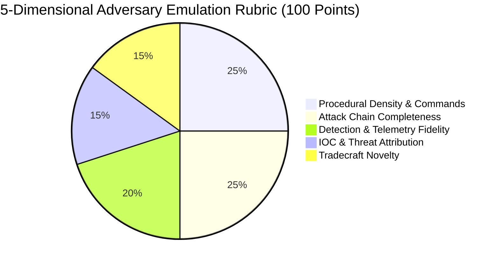

# Threat Intelligence Quality Methodology & Adversary Emulation Standards

> **Document Version**: 2.0  
> **Target System**: Adversary Intelligence Engine (AIE)  
> **Scope**: Advisory Threat Intelligence & Autonomous Adversary Emulation  
> **Maintenance**: Enforced autonomously across crawler pipelines, ingestion gates, and library storage.

---

## 1. Operating Charter & Scope

The Adversary Intelligence Engine (AIE) is purpose-built to collect, analyze, structure, and synthesize **actionable technical cyber threat intelligence (CTI)**. Its primary mission is to empower:

1. **Adversary Emulation & Simulation**: Constructing realistic adversary playbooks, atomic unit tests, Caldera scenarios, and infection chain replays.
2. **Threat Advisory & Tradecraft Intelligence**: Delivering deep, procedure-level intelligence dossiers on threat actors, campaigns, and zero-day vulnerabilities to security operations centers (SOCs) and detection engineering teams.
3. **Detection & Purple Team Engineering**: Validating detection coverage against real-world execution commands, LOLBins, registry persistence, and defensive telemetry (Sysmon, Windows Event Logs, EDR telemetry).

### Scope Invariant
> [!IMPORTANT]
> The AIE Library exists **solely** to house high-fidelity, procedure-level threat intelligence. It is **not** a general infosec news aggregator, commercial marketing repository, or general IT blog directory. Every resource retained in the library must contribute directly to adversary emulation or actionable threat defense.

---

## 2. Strict Qualification Rubric

Before any scraped or discovered resource is ingested into the library, it must pass a dual-tier gate: **URL Structural Filtering** and **Technical Anchor Verification**.

### 2.1 URL Structural Filtering (Tier 1 Gate)

Candidate URLs must point to a deep technical article permalink. The ingestion pipeline enforces the following structural rules:

```
[Candidate URL]
      │
      ├── Match Generic / Non-Resource Pattern? ──► REJECT (Index / Category / Multimedia)
      │
      ├── Blacklisted Non-CTI Host? ──────────────► REJECT (Immigration, Civil Admin, Social)
      │
      ├── Path Depth < 2 & No Article Slug? ─────► REJECT (Shallow Path / Apex Root)
      │
      └── Verified Deep Article Permalink ───────► Proceed to Tier 2 (Content Qualification)
```

#### Hard-Rejected Patterns (Zero Tolerance)
- **Homepages & Locale Roots**: `/`, `/en`, `/en-us`, `/en_us`, `/index.html`
- **Aggregators & Navigation**: `/category/*`, `/tags/*`, `/topics/*`, `/authors/*`, `/archive/*`, `/page/*`
- **Administrative & Index Endpoints**: `/all-news-updates`, `/latest-publications`, `/resources`, `/white-papers`, `/tips-advice`, `/business-security`, `/eset-research` (without slug)
- **Multimedia & Podcasts**: `/podcasts/*`, `/webinars/*`, `/videos/*`, `/interviews/*`, `/events/*`, `*talos_takes*`
- **Corporate, Legal & Policy Pages**: `/privacy-policy`, `/terms-of-service`, `/disclosure-policy`, `/careers`, `/pricing`, `/contact-us`, `/about-us`, `/sitemap*`
- **Non-CTI Civil Administrative Hosts**: `uscis.gov`, `ice.gov`, `e-verify.gov`, `dhs.gov` (non-CISA portals), `irs.gov`, `state.gov`, `treasury.gov`

---

### 2.2 Content Technical Anchor Verification (Tier 2 Gate)

A document that passes Tier 1 must possess **concrete procedural, attributional, or defensive artifacts** to qualify. A document with high word count is **rejected** if it lacks technical anchors.

To pass Tier 2, the document **MUST** satisfy at least one of the following criteria:

| Technical Anchor Category | Minimum Requirement | Description / Examples |
|---|---|---|
| **Execution Commands** | $\ge 1$ Concrete Command | LOLBins, PowerShell, cmd, bash, API sequences (e.g. `powershell.exe -enc`, `certutil -urlcache`, `rundll32`, `vssadmin delete shadows`) |
| **MITRE ATT&CK Mappings** | $\ge 1$ Technique Code | Explicit technique IDs (e.g. `T1059.001`, `T1055`, `T1003`, `T1547`) |
| **Verified Technical IOCs** | $\ge 1$ Concrete IOC | SHA256/MD5 sample hashes, C2 IP addresses, defanged malicious domains |
| **Vulnerability Advisory** | $\ge 1$ Verified CVE | CVE identifier with root cause or exploitation mechanics analysis (e.g. `CVE-2023-38831`) |
| **System Artifacts** | $\ge 1$ Key / Path / Event | Registry keys (`HKLM\Software\...`), file paths (`AppData\Local\Temp\...`), or Event IDs (Event 4688, Sysmon 1/3/7) |
| **In-Depth Attack Progression** | $\ge 3$ Terms + $\ge 350$ words | Sequential attack progression context (`Initial Access` $\rightarrow$ `Lateral Movement` $\rightarrow$ `Command & Control` $\rightarrow$ `Exfiltration`) |

> [!CAUTION]
> General journalistic news blurbs (e.g., general reporting on ransomware victim statistics, legal lawsuits, or executive appointments) that lack any technical execution commands or IOCs are **strictly disqualified**.

---

## 3. The 5-Dimensional Tradecraft Evaluation Rubric

When autonomous AI evaluation is enabled, resources are evaluated on a 100-point scale across 5 dimensions:



### Dimension Breakdown
1. **Procedural Density & Commands (25 Points)**:
   - Presence of raw execution commands, scripts, LOLBins, process injection techniques, or binary flags.
2. **Attack Chain Completeness (25 Points)**:
   - Clear multi-stage intrusion progression: Dropper $\rightarrow$ Loader $\rightarrow$ Execution $\rightarrow$ Persistence $\rightarrow$ Lateral Movement $\rightarrow$ C2 $\rightarrow$ Impact.
3. **Detection & Telemetry Fidelity (20 Points)**:
   - Sigma rules, YARA signatures, EDR telemetry patterns, Windows Event IDs (4688, 4624, 7045), Sysmon telemetry.
4. **IOC & Threat Attribution (15 Points)**:
   - Defanged network indicators, file hashes, named threat actors (e.g. APT29, Volt Typhoon, Lazarus, FIN7), targeted sectors.
5. **Tradecraft Novelty (15 Points)**:
   - Emerging adversary techniques: BYOVD (Bring Your Own Vulnerable Driver), direct syscalls, EDR unhooking, AMSI/ETW patching, living-off-the-cloud.

**Qualification Threshold**: Documents scoring $\ge 50$ points are approved. Documents scoring $< 50$ points are rejected.

---

## 4. Library Classification Taxonomy

Retained documents are classified into structured threat intelligence categories:

| Resource Classification | Resource Kind | Primary Engineering Use Case |
|---|---|---|
| `ATTACK_CHAIN_REPORT` | `FULL_ATTACK_CHAIN` | End-to-end intrusion flows for multi-stage scenario simulation |
| `ADVERSARY_EMULATION` | `PROCEDURE_DEEPDIVE` | Atomic unit tests, Caldera blueprints, and red team execution playbooks |
| `PURPLE_TEAM` | `PROCEDURE_DEEPDIVE` | Joint offensive emulation and defensive detection validation |
| `INTRUSION_REPORT` | `FULL_ATTACK_CHAIN` | Chronological incident response timeline for breach replication |
| `MALWARE_ANALYSIS` | `MALWARE_ANALYSIS` | Reverse engineering, unpacking, and payload behavior modeling |
| `DETECTION_RESEARCH` | `DETECTION_GUIDANCE` | Hunting queries, Sigma/YARA engineering, and detection gap analysis |
| `VULNERABILITY_REPORT`| `VULNERABILITY_ADVISORY` | Zero-day exploitation, PoC analysis, and patch diffing |
| `THREAT_ACTOR_REPORT` | `THREAT_ACTOR_DOSSIER` | Nation-state / cybercrime profiling, TTP heatmaps, targeting analysis |

---

## 5. Continuous Audit & Maintenance Protocol

To prevent scope creep and maintain library integrity over continuous multi-day crawler runs, the engineering team maintains automated audit tools:

### Operator CLI Commands

```bash
# Perform a dry-run audit of all library documents against CTI standards
npm run aie library audit

# Execute live pruning of all unqualified or low-signal documents from MongoDB
npm run aie library prune

# Execute deep cognitive AI audit using containerized AGY agent (5-dimensional rubric)
npm run aie library ai-audit --limit 10

# Execute deep cognitive AI audit with automatic pruning of AI-rejected non-threat records
npm run aie library ai-audit --prune --limit 25
```

### Automated Audit Scripts
- **Structural Audit & Pruning**: [`scripts/audit-and-prune-library.mjs`](file:///mnt/c/Users/AbishekPonmudi/Downloads/EIsj5xs92ARrG3Bd-grok-workspace/scripts/audit-and-prune-library.mjs)
- **Cognitive AI Agent Audit**: [`scripts/cognitive-ai-audit.mjs`](file:///mnt/c/Users/AbishekPonmudi/Downloads/EIsj5xs92ARrG3Bd-grok-workspace/scripts/cognitive-ai-audit.mjs)
- **Audit Log Artifacts**:
  - [`docs/library-audit-log.json`](file:///mnt/c/Users/AbishekPonmudi/Downloads/EIsj5xs92ARrG3Bd-grok-workspace/docs/library-audit-log.json)
  - [`docs/cognitive-ai-audit-log.json`](file:///mnt/c/Users/AbishekPonmudi/Downloads/EIsj5xs92ARrG3Bd-grok-workspace/docs/cognitive-ai-audit-log.json)
- **Frequency**: Automatically scheduled or triggered post-crawl to preserve a 100% high-signal repository.

---

## 6. Cognitive AI Tradecraft Rubric (AGY Container)

The autonomous AI approval gate executes inside `aie-agent-sandbox` via `agy` without any fallback to mock approvals or superficial heuristics:

| Dimension | Points | Core Criteria Evaluated by AI Agent |
|---|---|---|
| **1. Procedural Depth** | 0 – 30 | Concrete execution commands (PowerShell, cmd, LOLBins, bash), API call sequences, registry keys, process injection, DLL sideloading, or driver tampering. |
| **2. Attack Progression & Chain** | 0 – 25 | Multi-stage sequential intrusion flow (Initial Access -> Loader -> Execution -> Lateral Movement -> C2 -> Impact). |
| **3. Attribution & Context** | 0 – 15 | Identified threat actor (APT, cybercrime syndicate), campaign timeline, targeted sectors, or weaponized CVE references. |
| **4. Emulation & Detection Utility** | 0 – 20 | Direct utility for purple teams/SOC: Sigma rules, YARA rules, EDR/Sysmon telemetry queries, or Atomic Red Team / Caldera replay commands. |
| **5. IOC & Telemetry Verifiability** | 0 – 10 | Defanged network indicators (C2 IPs, domains), file hashes (SHA256), Windows Event IDs, Sysmon events. |

**Strict Cognitive Thresholds**:
- **Score $\ge 50$** AND **Classification $\ne$ "OTHER" / "GENERIC_NEWS"**: Approved (`status: "acquired"`, `aiVerified: true`).
- **Score $< 50$** OR **Classification $=$ "OTHER" / "GENERIC_NEWS"**: Rejected (`status: "rejected"`, `aiVerified: false`), permanently pruned if `--prune` / `autoPruneJunk` is active.

---

## 7. Engineering Verification Checklist

Before releasing or expanding crawler pipelines, engineers must verify:

- [x] Crawl frontier queue strictly validates `isCandidateResourceUrl` before enqueueing.
- [x] Root domains and index pages cannot be scheduled or fetched.
- [x] RSS/Atom feed entries are subjected to negative path and technical anchor filters.
- [x] Non-CTI government administrative hosts (`.gov` civil agencies) are blocked in `STRICT_BLOCKED_DOMAINS`.
- [x] Every retained document contains at least one verified procedural anchor (command, ATT&CK ID, IOC, or CVE).
- [x] Fake AI approval fallbacks (hardcoded 80-score mocks) are completely removed from `ai-manager.ts` and `repository.server.ts`.
- [x] The `aie library ai-audit` command executes live against the containerized AGY agent.
- [x] Misleading heuristic flags have been purged; `aiVerified: true` is strictly reserved for reports evaluated and approved by the LLM agent.
- [x] The `aie library audit` command reports 0% structural junk resources.
